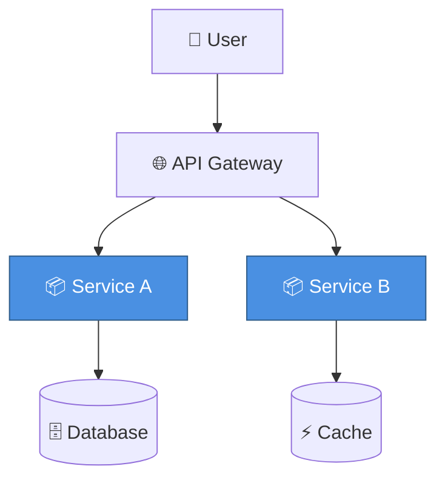

# Architecture Diagram Expert

Create professional architecture diagrams following industry best practices.

## Core Principles

Good architecture diagrams must be:

1. **Concise** - One diagram worth a thousand words
2. **Consistent** - Unified symbols, colors, and styles  
3. **Accurate** - Reflects actual system state
4. **Future-oriented** - Meets current needs with extensibility
5. **Code-aligned** - Matches implementation

## Workflow

### Step 1: Identify Diagram Type

Ask user to choose the diagram type using AskUserQuestion tool:

- **Business Architecture** - Business processes, modules, relationships
- **Application Architecture** - Application systems, APIs, data flow
- **Technology Architecture** - Tech stack, frameworks, middleware
- **Deployment Architecture** - Servers, networks, deployment topology
- **Data Architecture** - Data storage, flow, processing
- **Sequence Diagram** - Component interactions over time

See [diagram-types.md](references/diagram-types.md) for detailed guidance on each type.

### Step 2: Identify Key Elements

Based on diagram type, identify core components:

- Systems/Services
- Data stores
- External integrations
- Users/Roles
- Networks/Infrastructure

### Step 3: Map Relationships

Define relationship types:

- **Containment** (solid box) - A contains B
- **Invocation** (solid arrow `-->`) - A calls B
- **Data flow** (dashed arrow `-.->`) - Data flows A to B  
- **Dependency** (dashed line) - A depends on B
- **Peer** (horizontal alignment) - A and B are peers

### Step 4: Choose Output Format

Ask user preference using AskUserQuestion:

- **Mermaid** - Code-based, version control friendly
- **HTML/SVG** - Interactive web diagrams
- **ASCII Art** - Plain text for simple cases

See [visual-standards.md](references/visual-standards.md) for color, shape, and line conventions.

### Step 5: Generate Diagram

Create diagram with:

✅ The diagram itself  
✅ Legend  
✅ Component descriptions  
✅ Technology choices (if applicable)  
✅ Version and date  
✅ Author/Team info

## Quick Start Examples

### Microservices Architecture (Mermaid)

### Deployment Architecture

See [mermaid-templates/microservices.mmd](assets/mermaid-templates/microservices.mmd) for complete microservices template.

### Interactive HTML

See [html-templates/](assets/html-templates/) for interactive diagram templates with click-to-expand details.

## Common Mistakes

❌ **Information overload** - Too many details in one diagram  
✅ Use layered diagrams, split when needed

❌ **Inconsistent symbols** - Same concept, different representations  
✅ Define and follow symbol standards

❌ **Missing key info** - Over-simplified, missing components  
✅ Use checklist to ensure completeness

❌ **Disconnected from code** - Diagram doesn't match reality  
✅ Regular sync and review process

## Interview/Promotion Tips

1. **Tell the story** - Explain from business scenario
2. **Show tradeoffs** - Discuss technical choices
3. **Show evolution** - Demonstrate iteration and future plans
4. **Deep dive** - Explain key module design details
5. **Share lessons** - Discuss problems and solutions

## Checklist

Use TodoWrite to track:

- [ ] Identify diagram type
- [ ] List all key elements
- [ ] Map element relationships  
- [ ] Choose output format
- [ ] Apply visual standards (colors/shapes/lines)
- [ ] Add legend
- [ ] Ensure clarity
- [ ] Add version and date
- [ ] Team review
- [ ] Sync with actual code
