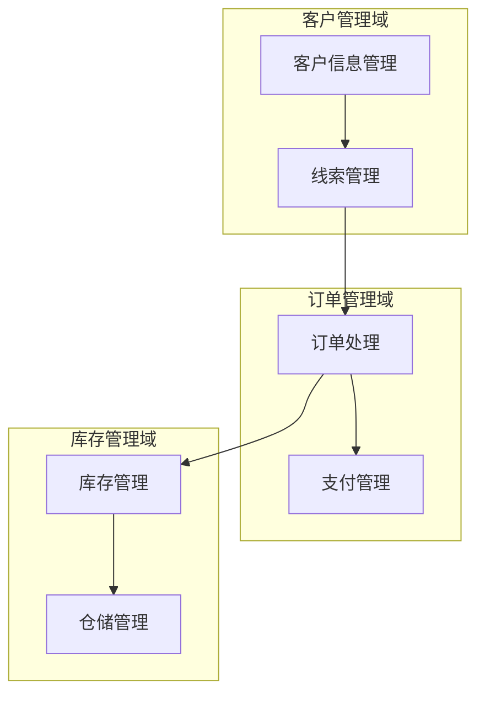
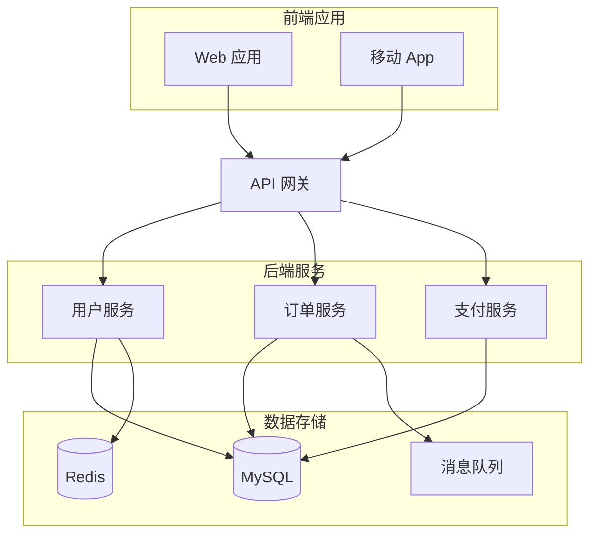
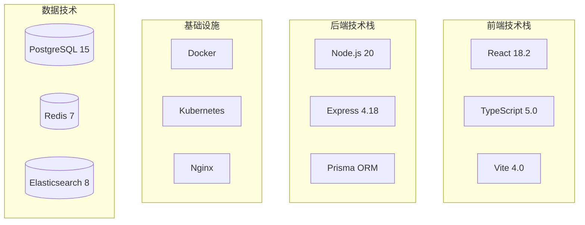
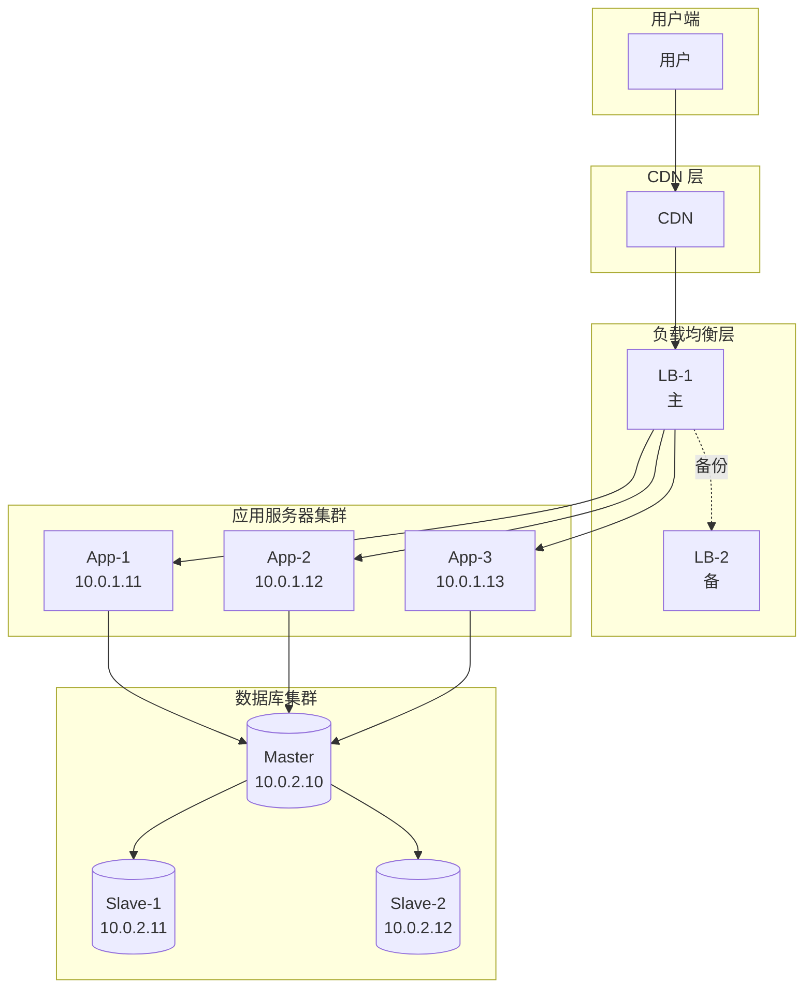
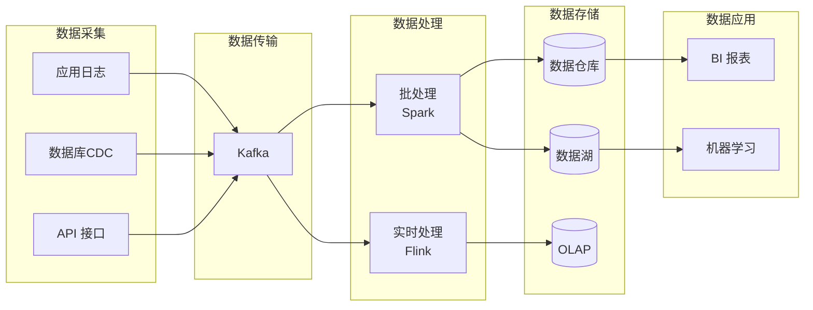
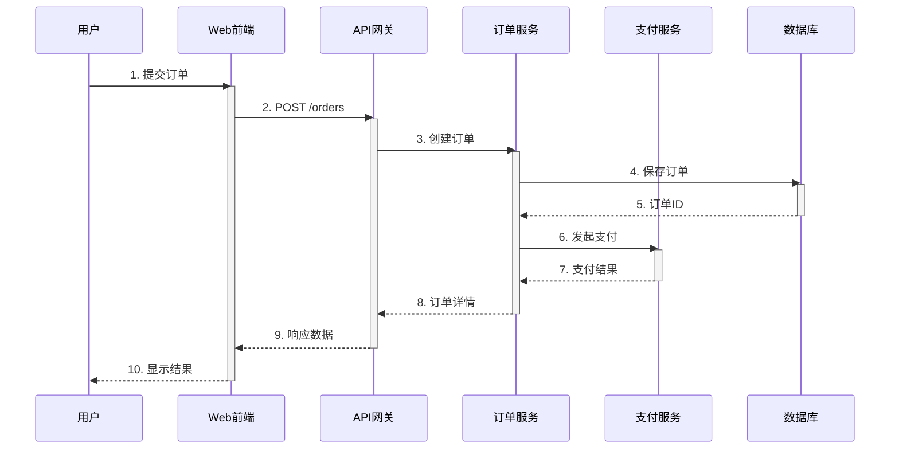
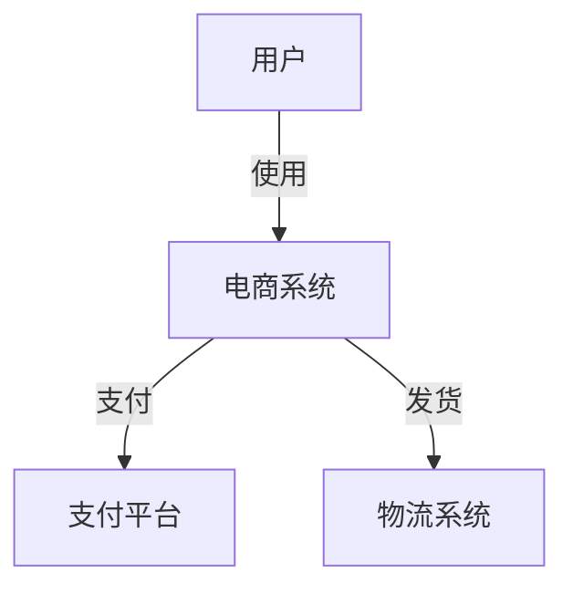
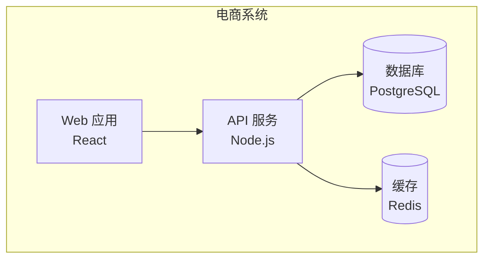
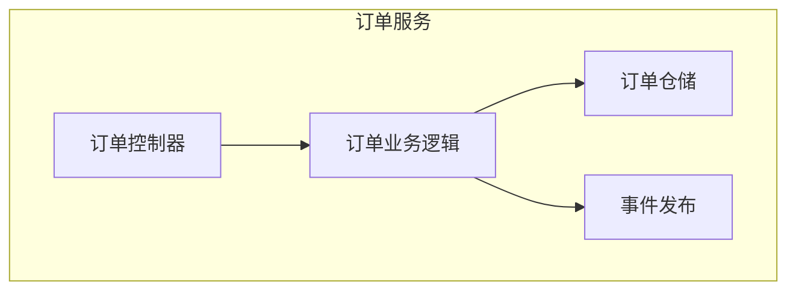

# 架构图类型详解

## 1. 业务架构图 (Business Architecture)

### 定义
描述业务能力、业务流程、组织架构及其之间的关系。

### 关键要素
- 业务领域/模块
- 业务能力
- 业务流程
- 用户角色
- 业务规则

### 最佳实践
- 从用户视角出发
- 避免技术细节
- 突出业务价值流
- 标注关键决策点

### 模板

## 2. 应用架构图 (Application Architecture)

### 定义
描述应用系统的组成、交互关系和数据流。

### 关键要素
- 应用系统/服务
- API 接口
- 数据流
- 集成点
- 安全边界

### 最佳实践
- 明确系统边界
- 标注通信协议
- 区分同步/异步
- 突出核心应用

### 模板

## 3. 技术架构图 (Technology Architecture)

### 定义
描述技术栈选型、技术组件及其层次关系。

### 关键要素
- 技术框架
- 编程语言
- 中间件
- 开发工具
- 技术标准

### 最佳实践
- 分层展示
- 标注版本号
- 说明选型理由
- 考虑技术债务

### 模板

## 4. 部署架构图 (Deployment Architecture)

### 定义
描述系统的物理部署、网络拓扑和运行环境。

### 关键要素
- 服务器/容器
- 网络设备
- 负载均衡
- 存储设备
- 安全组件

### 最佳实践
- 标注IP地址/端口
- 明确网络边界
- 标识单点故障
- 展示灾备方案

### 模板

## 5. 数据架构图 (Data Architecture)

### 定义
描述数据的存储、流转和处理方式。

### 关键要素
- 数据源
- 数据流向
- 数据存储
- 数据处理
- 数据质量

### 最佳实践
- 标注数据类型
- 说明数据量级
- 标识实时/批处理
- 关注数据安全

### 模板

## 6. 时序图 (Sequence Diagram)

### 定义
描述组件间按时间顺序的交互过程。

### 关键要素
- 参与者
- 消息
- 激活期
- 返回值
- 循环/条件

### 最佳实践
- 从左到右排列参与者
- 标注消息编号
- 区分同步/异步
- 突出关键路径

### 模板

## 7. C4 模型 (Context, Container, Component, Code)

### Level 1: 系统上下文图

### Level 2: 容器图

### Level 3: 组件图

### Level 4: 代码图
- 通常使用 UML 类图
- 展示类、接口、关系
- 在 SKILL 中不详细展开

## 选择指南

| 场景 | 推荐类型 | 原因 |
|------|---------|------|
| 向业务人员介绍系统 | 业务架构图 | 无技术术语，易理解 |
| 技术方案评审 | 技术架构图 + 应用架构图 | 全面展示技术选型 |
| 运维部署 | 部署架构图 | 物理部署清晰 |
| 数据治理 | 数据架构图 | 数据流向明确 |
| 接口对接 | 时序图 | 交互顺序清楚 |
| 系统设计面试 | C4 模型 | 分层次递进展示 |
