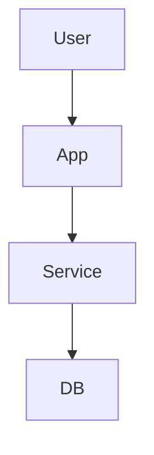
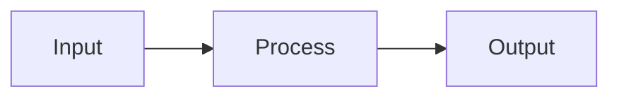
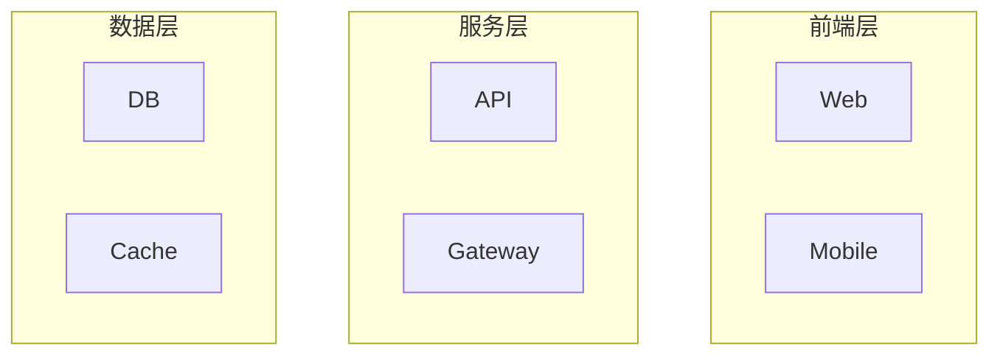

# 架构图视觉规范标准

## 颜色使用规范

### 核心业务模块 - 蓝色系
- **主色**: `#4A90E2` (70, 144, 226)
- **描边**: `#2E5C8A` (46, 92, 138)
- **用途**: 系统核心服务、主要业务模块
- **Mermaid**: `classDef core fill:#4A90E2,stroke:#2E5C8A,color:#fff`

### 基础设施 - 黄色系
- **主色**: `#F5A623` (245, 166, 35)
- **描边**: `#C17D11` (193, 125, 17)
- **用途**: 数据库、缓存、消息队列等基础组件
- **Mermaid**: `classDef infra fill:#F5A623,stroke:#C17D11,color:#fff`

### 外部服务 - 绿色系
- **主色**: `#7ED321` (126, 211, 33)
- **描边**: `#5FA319` (95, 163, 25)
- **用途**: 第三方API、外部集成服务
- **Mermaid**: `classDef external fill:#7ED321,stroke:#5FA319,color:#fff`

### 安全边界 - 红色系
- **主色**: `#D0021B` (208, 2, 27)
- **描边**: `#8B0000` (139, 0, 0)
- **用途**: 防火墙、安全网关、关键路径标识

### 辅助组件 - 灰色系
- **主色**: `#9B9B9B` (155, 155, 155)
- **描边**: `#4A4A4A` (74, 74, 74)
- **用途**: 可选模块、辅助功能、监控日志

## 形状使用规范

| 形状 | 图标 | 用途 | Mermaid 语法 |
|------|------|------|--------------|
| 矩形 | 📦 | 应用系统/服务/模块 | `[文本]` |
| 圆角矩形 | 🎯 | 进程/处理节点 | `(文本)` |
| 圆柱形 | 🗄️ | 数据库/存储 | `[(文本)]` |
| 菱形 | 💠 | 决策/判断节点 | `{文本}` |
| 圆形 | ⭕ | 开始/结束节点 | `((文本))` |
| 平行四边形 | 📄 | 输入/输出 | `[/文本/]` |
| 梯形 | 📊 | 数据处理 | `[/文本\]` |
| 子图 | 📋 | 分组/子系统 | `subgraph 标题 ... end` |

## 线条使用规范

### 实线箭头 `-->`
- **用途**: 同步调用、控制流、直接依赖
- **示例**: API 同步调用、方法调用
- **Mermaid**: `A --> B`

### 虚线箭头 `-.->` 
- **用途**: 异步调用、数据流、间接依赖
- **示例**: 消息队列、事件发布、缓存更新
- **Mermaid**: `A -.-> B`

### 粗实线 `==>`
- **用途**: 主要路径、核心流程
- **示例**: 用户主流程、关键业务链路
- **Mermaid**: `A ==> B`

### 双向箭头 `<-->`
- **用途**: 双向通信、相互调用
- **示例**: WebSocket 连接、双向同步
- **Mermaid**: `A <--> B`

### 无箭头线 `---`
- **用途**: 关联关系（非调用）
- **示例**: 配置关联、部署关系
- **Mermaid**: `A --- B`

## 布局原则

### 自顶向下（Top-Down）

- **适用**: 部署架构、层次架构
- **优点**: 清晰展示层级关系

### 从左到右（Left-Right）

- **适用**: 流程图、数据流
- **优点**: 符合阅读习惯

### 分层布局

- **适用**: 多层架构、微服务
- **优点**: 清晰的边界划分

## 图例标准格式

每个架构图都应包含图例，格式如下：

```
图例:
🔵 核心服务
🟡 基础设施  
🟢 外部服务
🔴 安全边界
⚪ 辅助组件
```

## 标注规范

### 版本信息
```
版本: v1.0
日期: 2025-12-19
作者: 架构团队
```

### 组件描述格式
```
[组件名称]
- 技术栈: React 18
- 职责: 用户界面渲染
- 关键特性: SSR, 代码分割
```

### 连接线标注
```
A --请求--> B
A -.事件.-> C
```
