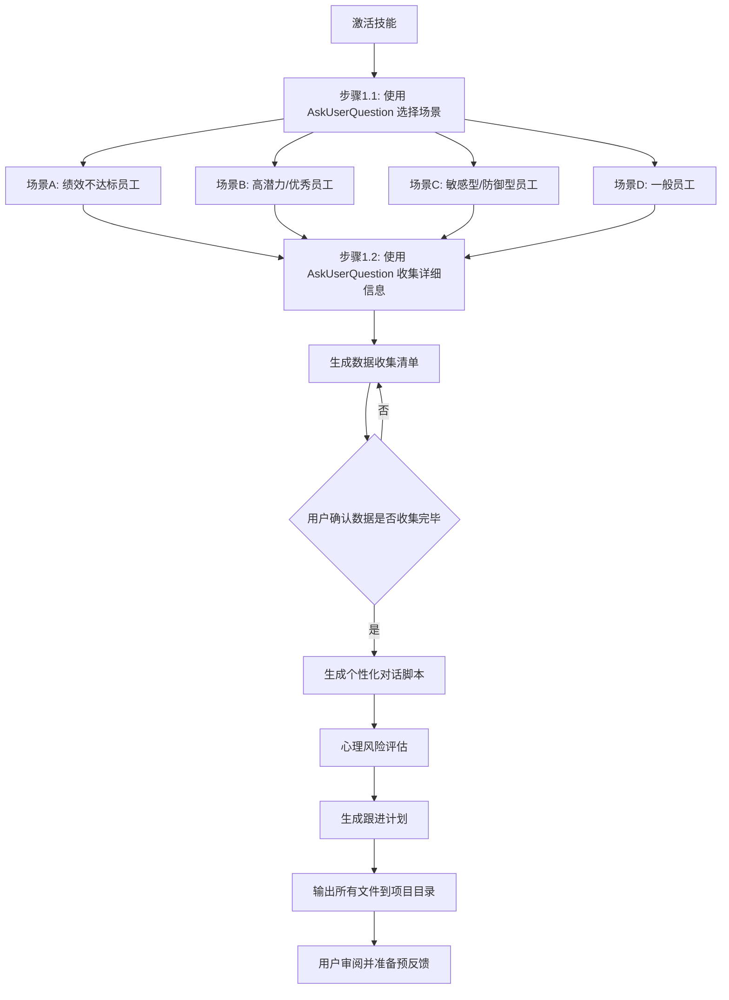

# 绩效预反馈专家技能

## 概述

这是一个系统化的绩效预反馈工具,帮助管理者:
- 🎯 **场景识别**: 通过 AskUserQuestion 工具交互式选择适配场景
- 📝 **模板生成**: 生成个性化的预反馈对话脚本
- 🧠 **心理分析**: 评估员工可能的心理反应和沟通风险
- 📊 **数据准备**: 指导收集关键数据和证据
- 🗓️ **跟进计划**: 自动生成行动计划和检查点

**核心特性**:
- ✨ 使用 `AskUserQuestion` 工具进行场景选择,支持4种预设场景
- ✨ 多轮交互式问答,精准收集员工信息
- ✨ 支持多选题型 (multiSelect) 识别员工复杂性格特征
- ✨ 根据场景自动匹配特殊处理流程

**自动触发条件**:
- 用户提到"绩效预反馈"、"绩效反馈"、"performance feedback"
- 用户询问"如何做绩效反馈"、"怎么给员工反馈"
- 用户描述员工绩效问题场景
- 用户请求"预反馈准备"、"绩效沟通"

**手动触发**: 使用 `/performance-pre-feedback` 或技能名称

---

## 核心工作流

### 阶段 1: 场景识别与分析

当技能激活时,首先通过 **AskUserQuestion 工具**进行交互式场景识别:

#### 步骤 1.1: 使用场景选择

使用 `AskUserQuestion` 工具询问用户的使用场景:

```json
{
  "questions": [
    {
      "question": "请选择您的绩效预反馈场景",
      "header": "场景类型",
      "options": [
        {
          "label": "绩效不达标员工",
          "description": "员工绩效明显低于预期,需要严肃谈话和改进计划"
        },
        {
          "label": "高潜力/优秀员工",
          "description": "员工表现优秀,重点是发展性反馈和晋升指导"
        },
        {
          "label": "敏感型/防御型员工",
          "description": "员工性格敏感或容易防御,需要特殊沟通技巧"
        },
        {
          "label": "一般员工",
          "description": "员工绩效正常,使用标准预反馈流程即可"
        }
      ]
    }
  ]
}
```

#### 步骤 1.2: 详细信息收集

根据用户选择的场景,继续使用 `AskUserQuestion` 收集详细信息:

```json
{
  "questions": [
    {
      "question": "员工当前的绩效状态如何?",
      "header": "绩效状态",
      "options": [
        {
          "label": "优秀/超预期",
          "description": "绩效明显超出岗位期望,是团队标杆"
        },
        {
          "label": "符合预期/中等",
          "description": "绩效达到岗位要求,没有明显问题"
        },
        {
          "label": "接近预期/需改进",
          "description": "基本达标但有提升空间,需要改进"
        },
        {
          "label": "不达标/问题严重",
          "description": "绩效明显低于预期,存在严重问题"
        }
      ]
    },
    {
      "question": "本次预反馈的主要目的是什么?",
      "header": "反馈目的",
      "options": [
        {
          "label": "正向激励+发展指导",
          "description": "主要给予认可和鼓励,引导职业发展"
        },
        {
          "label": "问题纠正+改进计划",
          "description": "指出具体问题,制定明确的改进计划"
        },
        {
          "label": "期望管理+能力提升",
          "description": "调整期望,帮助员工提升关键能力"
        },
        {
          "label": "绩效警示+最后机会",
          "description": "严肃警告,给予最后改进机会"
        }
      ]
    },
    {
      "question": "员工的性格特征有哪些?(可多选)",
      "header": "性格特征",
      "multiSelect": true,
      "options": [
        {
          "label": "防御型",
          "description": "容易抵触批评,习惯找借口或归因外部"
        },
        {
          "label": "自驱型",
          "description": "主动寻求反馈,愿意改进和成长"
        },
        {
          "label": "敏感型",
          "description": "情绪容易波动,对负面反馈反应较大"
        },
        {
          "label": "成熟型",
          "description": "理性接受反馈,能客观看待问题"
        }
      ]
    }
  ]
}
```

> **注意**: 第3个问题使用了 `multiSelect: true`,允许用户选择多个性格特征,因为员工性格往往是多面的。

**分析输出**:
- 员工类型标签 (如: "中等绩效/防御型员工")
- 沟通风险等级 (低/中/高)
- 推荐沟通策略 (支持型/直接型/平衡型)
- 自动匹配对应的特殊场景处理流程

---

### 阶段 2: 数据收集指导

基于场景自动生成**数据收集清单**:

#### 通用数据项
```
□ OKR/KPI 完成率 (具体数字)
□ 关键项目产出 (最近 3-6 个月)
□ 正向贡献事件 (至少 2-3 个)
□ 问题事件记录 (具体时间+影响)
□ 同事/跨部门反馈 (360度)
□ 上次反馈后的改进情况
```

#### 场景化数据
- **优秀员工**: 重点收集"成长瓶颈"和"更高目标"相关数据
- **问题员工**: 重点收集"业务影响"和"改进空间"量化数据
- **敏感型员工**: 准备"正面案例"平衡负面反馈

**工具输出**: 自动生成 `feedback-data-checklist.md` 文件

---

### 阶段 3: 对话脚本生成

生成完整的预反馈对话脚本,包含:

#### 3.1 开场白 (5分钟)
```
【温和开场】(适用于敏感型/防御型)
"[姓名],我们今天聊聊你近期的工作表现。这次是预反馈,
目的是让你提前了解我的评估方向,你也有时间在正式评估前
做调整。首先我想听听你自己怎么看这段时间的工作?"

【直接开场】(适用于成熟型/自驱型)
"[姓名],直入主题 - 我想提前同步下对你的绩效评估方向。
这样你有时间改进,正式评估时不会有意外。我们先说说你
做得好的部分,然后谈谈提升空间。"
```

#### 3.2 正向反馈 (10分钟)
```
"你在这些方面表现出色:

1. [具体成就 A] 
   → 对团队/业务的影响: [具体指标/结果]
   → 这体现了你的 [能力标签]

2. [具体成就 B]
   → 影响: [量化数据]
   → 特质: [积极反馈]

[针对优秀员工额外补充]
特别是 [某个亮点项目],这超出了岗位期望,
展现了你的 [高潜力特质]。"
```

#### 3.3 改进反馈 (15-20分钟)
**【关键】使用 SBI 模型** (Situation - Behavior - Impact)

```
"有几个方面我认为还有提升空间:

【问题 1: [具体问题名称]】
- 情境: [何时何地发生]
- 行为: [你具体做了什么/没做什么]
- 影响: [对业务/团队/他人的影响]
- 期望: [我希望未来看到的表现]
- 支持: [我可以提供的帮助]

示例:
【问题: 项目风险同步不及时】
- 情境: 上个月 X 项目进行到关键阶段
- 行为: 你在周会上没有同步延期风险,直到项目 deadline
  前 3 天才紧急汇报
- 影响: 老板在高层会议上被动,团队紧急加班 2 天赶工期,
  影响了其他项目排期
- 期望: 发现风险后 24 小时内同步给我,我们提前协调资源
- 支持: 我会每周专门留 30 分钟和你过一遍项目风险
```

**【防御型员工特殊处理】**
```
在每个问题后增加缓冲问句:
"你怎么看这个情况? 有没有我不了解的背景?"
(给对方解释机会,降低防御心理)
```

#### 3.4 双向讨论 (10分钟)
```
开放式提问:
1. "你对这些反馈有什么想法?"
2. "有哪些困难是我没有注意到的?"
3. "你觉得改进的最大障碍是什么?"
4. "你需要什么样的支持?"

【倾听原则】
- 不打断,让对方充分表达
- 记录关键信息 (尤其是客观困难)
- 对合理解释表示理解,但坚持核心问题
```

#### 3.5 行动计划 (10分钟)
```
"接下来到正式评估前的 [X周],我们一起制定改进计划:

【问题 A: [具体问题]】
- 你的改进行动: [由员工提出,管理者补充]
- 衡量标准: [可观测的行为/结果指标]
- 检查时间点: [具体日期]
- 我的支持: [资源/指导]

【示例】
问题: 项目风险同步不及时
- 改进行动: 
  1. 每周五下班前发风险日报 (邮件抄送我)
  2. 发现 P0/P1 风险 24h 内单独同步
- 衡量标准: 
  连续 4 周无遗漏,且至少提前 3 天预警 1 次重大风险
- 检查时间点: 
  每周五下午 5:30 我会查看日报,第 4 周末总结复盘
- 我的支持: 
  每周一 1-on-1 时教你风险识别方法,前 2 周我会主动提醒
```

#### 3.6 积极收尾 (5分钟)
```
【鼓励型收尾】(适用于多数场景)
"我相信你有能力改进这些问题。你在 [具体优势] 上已经
证明了自己的能力,这次只是需要把这种能力应用到 [问题领域]。
接下来几周我会持续支持你,有问题随时找我。"

【严肃型收尾】(适用于问题严重员工)
"我需要强调,这些问题已经影响到了团队和业务。正式评估时,
如果没有明显改进,可能会影响你的评级和奖金。但现在还有
[X周] 时间,我希望看到你的改变。"
```

**工具输出**: 自动生成 `feedback-script-[员工姓名].md` 对话脚本

---

### 阶段 4: 心理风险评估

使用心理学模型评估沟通风险:

#### 风险维度
1. **防御反应风险** (0-10分)
   - 评估标准: 过往对批评的反应,性格特征
   - 高风险特征: 经常找借口,归因外部,情绪激动

2. **情绪崩溃风险** (0-10分)
   - 评估标准: 抗压能力,当前状态
   - 高风险特征: 最近生活压力大,敏感多疑

3. **被动接受风险** (0-10分)
   - 评估标准: 表面认同但不改变
   - 高风险特征: 过往反馈后无行动,逃避型人格

#### 风险应对策略
```
【高防御风险】
- 策略: 增加正向反馈比例 (正:负 = 5:5)
- 话术: 多使用"我观察到..."而非"你总是..."
- 节奏: 拉长反馈时间,分段消化

【高情绪风险】
- 策略: 准备安抚话术,预留情绪缓冲时间
- 话术: "我理解这些反馈可能让你不舒服..."
- 准备: 面巾纸,私密会议室,避开公共区域

【被动接受风险】
- 策略: 行动计划要具体到"每日任务",频繁检查
- 话术: "我们现在就把第一步行动写下来"
- 机制: 每周检查,而非等到正式评估
```

**工具输出**: 生成 `risk-assessment-[员工姓名].md` 风险报告

---

### 阶段 5: 会后跟进计划

自动生成结构化跟进计划:

```markdown
# 预反馈跟进计划: [员工姓名]

## 即时行动 (会后 24h)
- [ ] 发送会议纪要邮件 (包含行动计划)
- [ ] 在 HR 系统记录预反馈完成
- [ ] 设置日历提醒 (首次检查点)

## 第 1 周检查点
**时间**: [具体日期]
**检查内容**:
- [ ] 员工是否开始执行改进行动?
- [ ] 是否遇到预期外的困难?
- [ ] 情绪状态是否稳定?

**准备**:
- 回顾行动计划第 1 条
- 准备具体改进建议 (如果进展不佳)

## 第 2-3 周检查点
[同上结构]

## 第 4 周总结复盘
**时间**: 正式评估前 1 周
**检查内容**:
- [ ] 对比初始问题,改进程度如何? (0-100%)
- [ ] 哪些问题已解决? 哪些仍需努力?
- [ ] 正式评估等级是否需要调整?

**输出**:
- 正式评估草稿 (基于预反馈后表现)
- 如果改进显著 → 正向反馈为主
- 如果无改进 → 准备严肃谈话

## 意外情况应对
**如果员工强烈抵触**:
1. 暂停对话,给予冷静时间
2. 24h 后单独沟通:"我理解你的感受,我们再聊聊"
3. 必要时上报 HRBP 介入

**如果员工提出离职**:
1. 了解真实原因 (是反馈导致还是其他因素)
2. 如果因反馈离职 → 评估是否过于严厉
3. 如果本就有离职意向 → 转为离职面谈
```

**工具输出**: 生成 `follow-up-plan-[员工姓名].md`

---

## 特殊场景处理

### 场景 A: 绩效不达标员工

**数据准备重点**:
- ✅ 量化业务损失 (延期天数,客户投诉数,返工成本)
- ✅ 与团队平均水平对比 (突出差距)
- ✅ 改进后的预期收益

**对话脚本调整**:
- 开场更直接:"我们需要严肃谈谈你的绩效问题"
- 正负反馈比例: 3:7 (少量正面 + 重点问题)
- 明确后果:"如果 X 周内无改进,可能影响转正/评级/奖金"

**心理风险**:
- 高防御风险,需准备大量客观证据
- 可能出现情绪激动,需预留缓冲时间

**跟进计划**:
- **每周**检查 (而非双周),高频监督
- 设定"最低可接受标准"和"理想改进目标"

---

### 场景 B: 高潜力/优秀员工

**数据准备重点**:
- ✅ 超预期成就清单 (对标更高级别要求)
- ✅ 未来发展路径选项 (晋升/横向轮岗/技能拓展)
- ✅ 当前短板分析 (阻碍晋升的因素)

**对话脚本调整**:
- 开场:"你这段时间表现很好,我想和你聊聊下一步发展"
- 正负反馈比例: 7:3 (大量认可 + 发展性反馈)
- 重点不是"纠错"而是"提升天花板"

**示例改进反馈**:
```
"你的技术能力已经达到 senior 水平,但如果想晋升 staff,
需要在这些方面提升:

1. 技术影响力: 目前你的方案在团队内很好,但跨团队影响力
   还不够。建议:
   - 下季度主导 1 个跨部门技术方案
   - 在公司技术分享会做 1-2 次分享
   
2. 人才培养: Staff 级别需要带新人。建议:
   - 下半年 mentor 1-2 个初级工程师
   - 参与校招面试和新人培训
```

**心理风险**:
- 低风险,但需防止"期望过高"导致压力
- 优秀员工可能对"不完美"反馈敏感

**跟进计划**:
- 双周检查 (频率低于问题员工)
- 重点关注"发展性目标"而非"纠错"

---

### 场景 C: 敏感型/防御型员工

**对话脚本特殊技巧**:

#### 技巧 1: "三明治反馈法" (Sandwich Feedback)
```
正向反馈 → 改进建议 → 正向鼓励

示例:
"你在技术细节上很认真 (正向)
但有时会因为过度追求完美导致项目延期 (改进)
我相信你能在质量和效率间找到平衡 (鼓励)"
```

#### 技巧 2: "我观察到" 语言模式
```
❌ "你总是不主动沟通"
✅ "我观察到在 X 项目中,有 3 次关键信息你没及时同步"

❌ "你的代码质量不行"
✅ "我看到你提交的 PR 中,有 5 个被 review 出明显 bug"
```

#### 技巧 3: 预设缓冲问句
```
每个问题后加:
"我说的这些,有没有你觉得不够准确的地方?"
"你当时是怎么想的? 我想听听你的视角"
```

**心理风险应对**:
- 如果对方开始哭泣:
  1. 递纸巾,暂停 2-3 分钟
  2. "我理解这些话可能让你不舒服,我们慢慢聊"
  3. 不要因为哭泣而放弃反馈核心内容
  
- 如果对方激动辩解:
  1. 先倾听,不要打断
  2. "我听到了你的解释,这些客观因素我理解"
  3. "同时,我们还是需要讨论如何改进..."

---

## 完整输出文件

技能执行完毕后,自动在项目根目录生成:

```
📁 performance-feedback-[日期]/
├── 📄 feedback-data-checklist.md       # 数据收集清单
├── 📄 feedback-script-[姓名].md        # 完整对话脚本
├── 📄 risk-assessment-[姓名].md        # 心理风险评估
├── 📄 follow-up-plan-[姓名].md         # 跟进计划
└── 📄 quick-reference.md               # 快速参考卡片
```

### 快速参考卡片示例

```markdown
# 预反馈快速参考 - [员工姓名]

## 员工档案
- **绩效状态**: 接近预期/需改进
- **性格类型**: 防御型
- **沟通风险**: ⚠️ 中等 (防御反应风险 7/10)
- **推荐策略**: 平衡型沟通 (正:负 = 5:5)

## 3 个必说的优点
1. [具体优点 1 + 影响]
2. [具体优点 2 + 影响]
3. [具体优点 3 + 影响]

## 3 个核心问题
1. [问题 1]: [SBI 一句话描述]
2. [问题 2]: [SBI 一句话描述]
3. [问题 3]: [SBI 一句话描述]

## 关键话术速查
**如果对方抵触**: "我理解你的感受,我们一起看看具体数据..."
**如果对方沉默**: "我想听听你的想法,你怎么看这个情况?"
**如果对方哭泣**: [递纸巾] "我们可以休息几分钟"

## 底线要求
- 必须改进的 1 号问题: [XXX]
- 衡量标准: [具体指标]
- 检查时间: [X 周后]
- 不改进后果: [影响评级/奖金]

## 下次见面
⏰ [日期] [时间] - 第 1 周检查点
📋 准备: 查看改进行动第 1 条的完成情况
```

---

## 使用流程总结



---

## 最佳实践

### ✅ 推荐做法
1. **提前 1 周使用技能** - 给自己充足时间收集数据和演练
2. **打印快速参考卡片** - 对话时随时查看要点
3. **录音或记笔记** - 会后整理员工反应和承诺
4. **严格执行跟进** - 如果不跟进,预反馈等于零

### ❌ 避免陷阱
1. 🚫 不要在公开场合做预反馈 (必须私密空间)
2. 🚫 不要在周五下午反馈 (员工周末焦虑)
3. 🚫 不要超过 60 分钟 (信息过载,效果递减)
4. 🚫 不要只谈问题不给方案 (徒增焦虑)
5. 🚫 不要承诺做不到的支持 (失去信任)

---

## 引用资源

技能内部引用以下核心模块 (自动加载,无需用户操作):

- `core/sbi-model.md`: SBI 反馈模型详解
- `core/psychological-safety.md`: 心理安全沟通技巧
- `core/action-plan-framework.md`: 行动计划制定框架
- `templates/script-templates.md`: 各场景对话模板库
- `examples/case-studies.md`: 5 个真实案例分析

---

## 持续改进

**这是一个自我进化的技能**:
- 每次使用后,可以提供反馈 ("这个话术在我的场景不适用")
- 技能会学习你的管理风格,逐步个性化模板
- 积累的案例会丰富话术库和风险预测准确度

---

**准备好开始了吗?** 

只需告诉我员工的基本情况,技能将自动运行完整流程,为你生成一套完整的预反馈工具包!

---

## 使用示例

### 示例 1: 完整的工作流

```
用户: 我需要给一个绩效不达标的员工做预反馈

AI: 我将使用 AskUserQuestion 工具帮您准备绩效预反馈方案。

[调用 AskUserQuestion - 步骤 1.1]
问题: "请选择您的绩效预反馈场景"
→ 用户选择: "绩效不达标员工"

[调用 AskUserQuestion - 步骤 1.2]
问题1: "员工当前的绩效状态如何?"
→ 用户选择: "不达标/问题严重"

问题2: "本次预反馈的主要目的是什么?"
→ 用户选择: "问题纠正+改进计划"

问题3: "员工的性格特征有哪些?(可多选)"
→ 用户选择: ["防御型", "敏感型"]

[AI 分析输出]
✓ 员工类型: "绩效不达标/防御型+敏感型员工"
✓ 沟通风险等级: ⚠️ 高风险
✓ 推荐策略: 平衡型沟通 (正:负 = 4:6)
✓ 匹配场景: 场景A + 场景C (绩效不达标 + 敏感防御型)

[自动生成文件]
✓ feedback-data-checklist.md (重点收集量化业务损失数据)
✓ feedback-script-张三.md (使用SBI模型 + 三明治反馈法)
✓ risk-assessment-张三.md (防御反应风险 8/10, 情绪崩溃风险 7/10)
✓ follow-up-plan-张三.md (每周检查,准备HRBP介入预案)
✓ quick-reference.md (快速参考卡片,包含关键话术)
```

### 示例 2: 高潜力员工场景

```
用户: 我要给一个优秀员工做发展性反馈

[步骤 1.1] 用户选择: "高潜力/优秀员工"
[步骤 1.2] 
  - 绩效状态: "优秀/超预期"
  - 反馈目的: "正向激励+发展指导"
  - 性格特征: ["自驱型", "成熟型"]

[AI 分析输出]
✓ 员工类型: "优秀/自驱型员工"
✓ 沟通风险等级: ✅ 低风险
✓ 推荐策略: 发展型沟通 (正:负 = 8:2)
✓ 匹配场景: 场景B (高潜力员工)

[自动生成文件]
✓ 脚本重点: 晋升路径、技术影响力、人才培养
✓ 跟进频率: 双周检查 (频率低于问题员工)
✓ 数据清单: 超预期成就、对标更高级别要求
```
